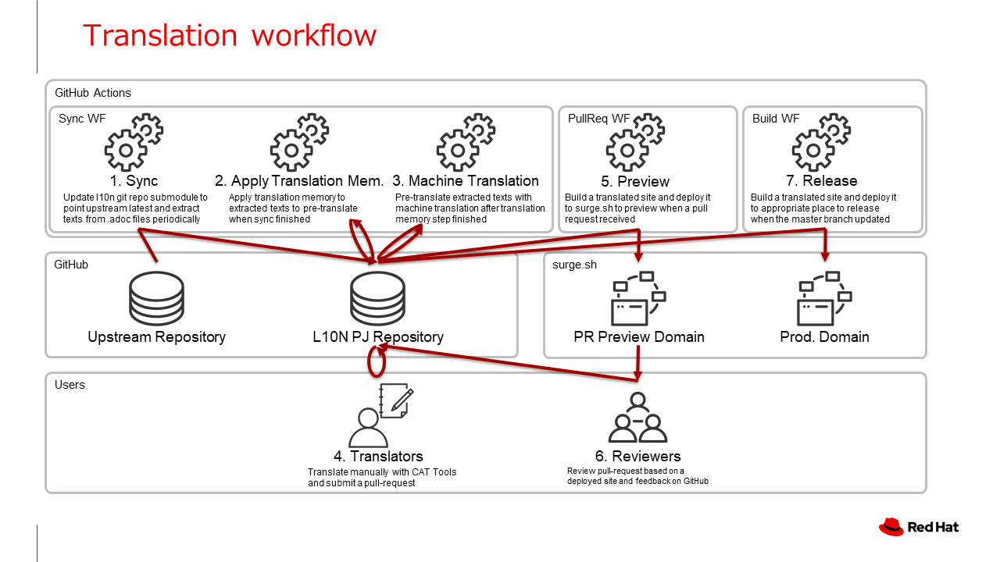

# camel-ja

[Apache Camel公式ウェブサイト](https://camel.apache.org/)の日本語翻訳プロジェクトです。以下の公式ウェブサイトのリポジトリを翻訳し、公開する作業を行っています。

- https://github.com/apache/camel-website

日本語ウェブサイトは現在以下に公開されてます。
- テスト／一時公開 - http://camel-ja.surge.sh/
- 正式URL（調整中） - https://jcug-oss.github.io/camel-ja/

## ローカライズアーキテクチャ

camel-jaは、[ja-quarkusio](https://github.com/quarkusio/ja.quarkus.io)プロジェクトの成果を元にしています。

オリジナルの[Apache Camelウェブサイト](https://github.com/apache/camel-website)はAntora + Hugoで構築されています。
その内容のほとんどは、Markdown（`.md`）ファイルとAsciidoctor（`.adoc`）ファイルで書かれています。
camel-jaは [po4a](https://po4a.org/)を使ってテキストを`po`ファイルに展開し、翻訳します。
その後、元のテキスト形式（`.md`または`.adoc`）に書き戻して、ローカライズされたサイトを構築します。
DeepL APIによる下訳処理を含むほとんどのワークフローは、GitHub Actionsによって自動化されています。
翻訳プロジェクト参加者は、下訳をベースに翻訳の精度を向上させることに集中できます。
ローカライズに興味のある方は、`.po`ファイルを編集して、プルリクエストを送ってください。



### テキストファイルのローカライズ

#### Syncワークフロー

camel-jのGitHubリポジトリには、アップストリームリポジトリ（サブモジュール）の更新をチェックするGitHub Actionsワークフローが用意されています。
アップストリームのテキストファイルから[.poファイル](l10n/po)にテキストを抽出し、翻訳メモリとDeepL APIを使って下訳を行います。

#### .poファイルの翻訳

[l10n/po](l10n/po)ディレクトリにある`.po`ファイルを翻訳する必要があります。
`.po`ファイルはソフトウェアの国際化によく使われるファイル形式で、多くのCATソフトやSaaSが読み書きできるようになっています。
`.po`ファイルに対応した翻訳エディタには、Windows/Mac/Linuxで動作する[POEdit](https://poedit.net/)などがあります。
機械翻訳された`.po`ファイルには、`"fuzzy"`マークが付いています。
`"fuzzy"`マークを取り除き、必要に応じて不適切な訳文を修正します。

#### ローカライズされたサイトのビルド

プルリクエストを送信すると、GitHub Actionsワークフローが自動的に`.po`ファイルの翻訳をテキストファイルに適用します。
その後ローカライズされたサイトをビルドし、それをプレビュードメイン付きの surge.sh にデプロイします。
デプロイが完了すると、GitHub ActionsはそのURLをプルリクエストにコメントします。レビュアーは、デプロイされたサイトを確認できます。
プルリクエストが`main`ブランチにマージされると、自動的に本番サイトにデプロイされます（http://camel-ja.surge.sh/）。

#### ローカライズされたサイトをローカルにビルドする

ローカルにサイトをビルドしたい場合は、次のように実行します。

```
bin/apply-translation
bin/exec-antora-preview
```

サイトは`doc`ディレクトリにビルドされ、 http://localhost:1313/ で見ることができます。

### HTMLテンプレートのローカライズ

[Apache Camelウェブサイト](https://camel.apache.org/)のほとんどのコンテンツは`.md`または`.adoc`ファイルですが、いくつかのテキストはHTMLテンプレートになっています。
HTMLテンプレートは[po4a](https://po4a.org/)では解析できないので、このローカライズプロジェクトのリポジトリでは直接翻訳したHTMLテンプレートを[l10n/override](l10n/override)に置いています。
アップストリームリポジトリのテンプレートが更新されると、GitHub Actionsのワークフローが自動的にIssueを作成して通知します。
どのファイルが更新されたかは、[l10n/stats/override.csv](l10n/stats/override.csv)を参照してください。
変更されたオーバーライドファイルは常に更新して、最新の状態にしてください。

## FAQ

### 一部のガイドやブログ記事が翻訳されていません。

これらの記事は翻訳されていませんが、対応する`.po`ファイルに機械翻訳が用意されています。
`.po`ファイルの訳文を編集後、該当の`"fuzzy"`マークを削除してプルリクエストを送信してください。

### 翻訳された記事の中に翻訳されていない文章がある

対応するアップストリームの文章が更新され、以前に完成させた翻訳が利用できなくなっているようです。
対応する`.po`ファイルの訳文を更新し、該当の`"fuzzy"`マークを削除してプルリクエストを送信してください。

## コントリビュートするには

プルリクエストや問題の報告を歓迎します。

翻訳の流れについては、[翻訳ガイド](./translation-guide.ja.md)を参照してください。

## ライセンス

camel-jaは、[Apache 2.0ライセンス](http://www.apache.org/licenses/LICENSE-2.0.html)の下で公開されているオープンソースプロジェクトです。
